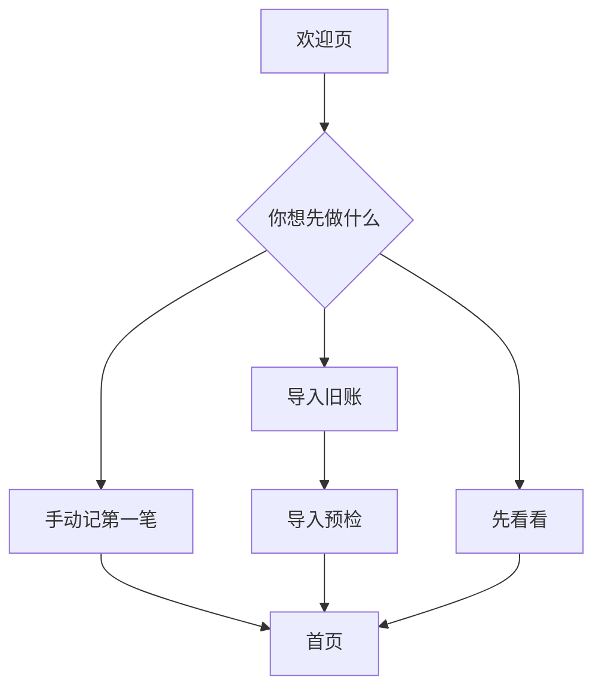

# 礼小记 UI/UX 升级设计文档 v2.0

> 文档状态：设计与开发实施基线  
> 编写日期：2026-07-11  
> 设计范围：iPhone、iPad、深色模式、无障碍、App Store 素材  
> 关联文档：[升级技术方案](./礼小记升级技术方案-v2.0.md)、[升级审计与增长路线图](./2026-07-11-app-upgrade-audit.md)

## 1. 升级目标

### 1.1 产品体验目标

礼小记不再只回答“过去收送了多少钱”，还要帮助用户完成下一步：

1. 快速把旧账安全搬进 App。
2. 在收到邀请或准备回礼时，立即查到历史依据。
3. 用最少操作创建记录、提醒或回礼。
4. 清楚知道数据保存在何处、能否恢复、是否开启 iCloud。
5. 在 iPhone 上高效录入，在 iPad 上高效整理。

### 1.2 设计成功标准

| 指标 | 目标 |
|---|---:|
| 首次启动到可操作 | 1 个选择页以内 |
| 手动新增单条记录 | 中位时间 < 10 秒 |
| 从联系人历史创建回礼 | < 10 秒、<= 3 次主要点击 |
| 100 条 CSV 导入 | 可预检、可纠错、一次提交 |
| 核心页面大字体 | AX3 下无裁切和遮挡 |
| VoiceOver | 核心流程完整可操作 |
| iPad | 列表与详情无需反复 Push |

## 2. 当前体验问题

### 2.1 信息架构

- 联系人和事件是核心任务，却被藏在“我的”。
- “统计”占据一级 Tab，但低频查看，挤压了高频的“查人和回礼”。
- 首页以本月收支为主，用户仍需自己推理下一步行动。
- 录入入口在多个页面以悬浮按钮重复出现，导航规则不一致。

### 2.2 视觉

- 白色卡片数量过多，几乎所有区块都被框住，页面层级单一。
- 品牌红使用较多，但图标、卡片、标签表现近似，缺少“礼簿/回礼”专属识别。
- App 图标像通用钱包，更接近普通记账产品。
- iPad 页面横向拉伸，字号和内容密度与画布不匹配。

### 2.3 交互

- 新用户第一次进入主界面就收到通知权限弹窗，缺少上下文。
- 付费能力只在触发限制时解释，容易产生“突然被拦”的感觉。
- iCloud 页面显示“已同步”，但用户无法知道哪些数据真的已经安全保存。
- OCR/语音批量失败仍可能关闭页面，缺少可信结果反馈。
- 删除与清空强调“不可恢复”，却没有就地备份动作。

### 2.4 无障碍

- 金额、方向、差额没有完整朗读语义。
- 图表缺少文本摘要和数据表。
- 固定字号、固定宽高较多，大字体存在风险。
- 动效没有统一响应 Reduce Motion。

## 3. 设计原则

### 3.1 行动优先

首屏先展示“今天要处理什么”，再展示统计。每个模块都要有明确下一步，避免只有信息没有行动。

### 3.2 依据可见

任何回礼建议都显示来源日期、场景和历史金额。系统帮助用户回忆，不替用户定义人情关系。

### 3.3 数据安心

备份、导入、恢复、同步状态使用具体事实和时间，不用模糊的“安全”“已同步”替代证据。

### 3.4 渐进复杂度

录入默认只展示方向、金额、联系人、场景四项；日期、账本、归属、备注等放入“更多信息”，但编辑时仍能快速访问。

### 3.5 原生克制

优先使用系统 Tab、NavigationStack、NavigationSplitView、List、Menu、Sheet、Picker、Toggle。减少自绘悬浮导航、装饰卡片和过度动效。

### 3.6 隐私默认

后台默认遮挡；金额可一键隐藏；权限在用户触发功能后请求；导出和恢复不作为高级版筹码。

## 4. 用户与核心场景

### 4.1 家庭账目整理者

在婚礼、满月宴或春节后，一次录入几十至几百条；需要批量校对、男/女方归属、导出打印和家庭核对。

### 4.2 日常随礼用户

收到邀请时想快速查“上次他家给了多少”；使用频率不高，但每次都很急，要求搜索和回礼入口极快。

### 4.3 长期数据保管者

关注换机、iCloud、备份、恢复和隐私；只有确认数据不会丢、不会被锁，才愿意持续记录。

### 4.4 长辈协助者

替父母整理纸质礼簿，重视大字、清晰术语、少步骤和可打印格式。

## 5. 新信息架构

### 5.1 iPhone 一级导航

| Tab | 图标 | 内容 | 选择理由 |
|---|---|---|---|
| 首页 | `house.fill` | 待处理、快速记录、最近往来、概览 | 日常行动中心 |
| 往来 | `person.2.fill` | 联系人、回礼待办、提醒 | 把核心关系任务提升到一级 |
| 账本 | `book.closed.fill` | 账本、批量整理、归档 | 保留场景化管理 |
| 我的 | `person.crop.circle` | 数据安全、偏好、购买、关于 | 低频管理 |

“统计”从一级 Tab 移到首页概览的“查看分析”和账本详情的“分析”Tab。事件提醒并入“往来”，不再藏在设置。

### 5.2 iPad 一级导航

使用 `NavigationSplitView` 侧边栏：

```text
礼小记
├── 今日
├── 往来
│   ├── 联系人
│   └── 回礼待办
├── 账本
├── 提醒
├── 分析
├── 数据管理
└── 设置
```

列表在中栏，详情在右栏。侧边栏支持折叠；录入使用最大宽度 560pt 的 Sheet，不铺满 13 英寸。

### 5.3 全局新增

取消重复 FAB。所有一级页面右上角使用统一 `plus` 图标按钮，点击弹出 Menu：

- 手动记一笔
- 批量录入
- 扫描礼单（高级版）
- 语音录入（高级版）
- 新建提醒

首页同时保留可扫描的三项快捷操作，但不再另放悬浮加号。

## 6. 核心流程

### 6.1 首次启动



欢迎页只包含品牌、隐私承诺和三个开始路径，不轮播功能介绍。底部保留协议入口。通知、相机、麦克风权限都不在此页请求。

### 6.2 手动记录

```text
点击新增
-> 选择收到/送出
-> 输入金额
-> 选择或输入联系人
-> 选择场景
-> 保存
-> 成功回执，可继续记下一笔
```

保存后不强制关闭：提供“完成”和“继续记一笔”。婚礼现场连续录入时，保留方向、账本、日期和归属，仅清空金额与联系人。

### 6.3 查历史并回礼

```text
往来 -> 搜索联系人 -> 联系人详情
-> 查看“最近收到”依据
-> 点击“按这笔回礼”
-> 预填方向=送出、金额、场景、联系人
-> 用户确认/修改 -> 保存
-> 原记录标记已回礼并关联新记录
```

### 6.4 CSV 导入

```text
选择文件 -> 识别列 -> 映射列 -> 预检
-> 查看有效/警告/错误/重复
-> 修正或跳过 -> 创建恢复点
-> 一次导入 -> 校验结果 -> 完成摘要
```

### 6.5 开启 iCloud

```text
数据管理 -> iCloud -> 开启
-> 说明将同步的数据与前置备份
-> 检查账户 -> 自动备份
-> 检查本地/云端数据
-> 直接开启或进入合并预览
-> 完成后显示可验证状态
```

## 7. 页面总览

| 页面 | 主任务 | 主要行动 | 关键状态 |
|---|---|---|---|
| 欢迎/开始 | 选择开始方式 | 记一笔、导入、看看 | 新用户 |
| 首页 | 处理近期事项 | 回礼、记录、查看全部 | 空、正常、隐私模式 |
| 往来 | 找人和待办 | 搜索、新建联系人、完成回礼 | 搜索空、重复联系人 |
| 联系人详情 | 查看依据 | 按历史回礼、设提醒、编辑 | 无记录、多记录、待回礼 |
| 账本 | 管理场景 | 新建、批量录入、导出 | 空、归档、免费限制 |
| 账本详情 | 核对记录 | 记录、筛选、批量操作 | 空、筛选无结果 |
| 录入 | 快速保存 | 保存、继续录入 | 校验、保存中、失败 |
| 批量校对 | 修正识别/导入 | 全部保存 | 警告、错误、重复 |
| 提醒 | 准备重要事件 | 创建回礼、完成 | 今天、即将、逾期 |
| 分析 | 理解趋势 | 切换范围、钻取 | 无数据、部分数据 |
| 数据管理 | 保护和迁移数据 | 备份、恢复、导入、同步 | 正常、处理中、异常 |
| 高级版 | 理解并购买效率能力 | 购买、恢复购买 | 加载、失败、已购 |

## 8. 首页设计

### 8.1 内容顺序

1. 顶部标题与金额隐私按钮。
2. “今天要处理”列表，最多 3 项。
3. 快速记录工具栏。
4. 最近往来，最多 5 条。
5. 本月概览摘要。

### 8.2 iPhone 线框

```text
┌──────────────────────────┐
│ 礼小记                ◉  │  ◉ 隐藏/显示金额
│ 7月11日 周六              │
├──────────────────────────┤
│ 今天要处理          查看全部 │
│ 张宁婚礼 · 明天             │
│ 上次收到 ¥800     [准备回礼] │
│ 母亲生日 · 3天后     [设提醒] │
├──────────────────────────┤
│ 快速记录                    │
│ [记一笔] [扫礼单] [按住说话] │
├──────────────────────────┤
│ 最近往来              查看全部 │
│ 刘志强  收到 ¥888   2月6日   │
│ 高建华  送出 ¥1,600 2月5日   │
├──────────────────────────┤
│ 本月  收到 ¥3,128  送出 ¥7,054│
│                   [查看分析] │
└──────────────────────────┘
```

页面区块不使用外层浮动卡片。只有“待办行”和“记录行”在需要点击边界时使用浅表面色，圆角最大 8pt。

### 8.3 待办优先级

- 今天/逾期：主色图标，日期明确。
- 未来 7 天：常规文本。
- 超过 7 天：不进入首页前三项。
- 同一联系人多个提醒可以合并摘要，但进入后逐条处理。

### 8.4 空状态

没有任何数据时，首屏直接显示两个操作：“记第一笔”“导入旧账”。不展示 0 元统计卡和空图表。

## 9. 往来页

### 9.1 顶部结构

页面标题下使用双段 Segmented Control：`联系人 | 待回礼`。搜索栏始终可见。

### 9.2 联系人列表

每行显示：头像/首字、姓名、关系、最近往来日期、客观差额。不要用“对方欠我/我欠对方”，统一用：

- 往来差额 +¥800
- 往来差额 -¥500
- 已基本持平

金额隐藏模式下显示 `¥••••`，VoiceOver 朗读“金额已隐藏”。

### 9.3 待回礼列表

按日期分组：逾期、7 天内、稍后。每项展示联系人、事件、历史依据和两个动作：`准备回礼`、`不需处理`。左滑提供完成，右滑不放破坏性删除。

### 9.4 重复联系人提示

当存在高置信度重复项时，在列表顶部显示非阻断提示：“发现 3 组可能重复的联系人”，点击进入合并预览。不能自动合并。

## 10. 联系人详情

### 10.1 页面结构

1. 姓名、关系、归属、更多菜单。
2. 三项摘要：收到、送出、往来差额。
3. 主行动：记一笔、准备回礼、设提醒。
4. 往来时间线。
5. 关联提醒和备注。

### 10.2 时间线

按年份分组。节点使用绿色表示收到、灰色表示送出；不要只依赖颜色，同时显示箭头和文字。已关联的收到/回礼记录之间用“已回礼”文本关系连接。

### 10.3 历史依据条

当用户点击某条“收到”记录时，底部出现操作条：

```text
2025-10-03 · 张三婚礼 · 收到 ¥800
[按这笔回礼] [设为待回礼] [查看详情]
```

### 10.4 编辑与合并

“更多”菜单包含编辑、合并联系人、导出此人记录、删除。删除联系人前说明记录不会删除，只会解除关联并保留历史姓名。

## 11. 账本页

### 11.1 iPhone

账本改为单列紧凑列表，默认按最近使用排序。每行显示图标、名称、记录数、收到/送出摘要和最近更新。单列比两列卡片更适合长名称、大字体和快速比较。

用户可在菜单切换“紧凑网格”，但不作为默认。

### 11.2 新建账本

表单只包含名称、图标、颜色和可选归属。免费用户首次创建前就显示“免费版可使用 1 个账本”，而不是创建第二个时才解释。

### 11.3 账本详情

顶部紧凑摘要，下方 Segmented Control：`记录 | 分析`。工具栏提供筛选、搜索和更多菜单。批量模式通过 `checkmark.circle` 进入，支持修改归属、移动账本、导出和删除。

### 11.4 删除

删除确认显示影响：账本名、记录数、联系人聚合会重算。默认主按钮为取消；提供“先导出此账本”。

## 12. 录入体验

### 12.1 默认录入页

```text
┌──────────────────────────┐
│ 取消       记一笔       保存 │
│ [收到] [送出]              │
│           ¥ 800            │
│ ──────────────────────── │
│ 联系人  张宁                │
│          上次收到 ¥800       │
│ 场景    婚礼                │
│ [更多信息]                  │
│                            │
│      自定义数字键盘           │
└──────────────────────────┘
```

金额为第一视觉焦点。自定义键盘尺寸稳定，不随金额位数改变；超长金额缩小到可读范围，并设置业务上限确认。

### 12.2 联系人选择

输入后展示最近匹配。选择联系人时，在同一行下方显示最近历史依据，不跳转详情。新增联系人只要求姓名，关系和归属可稍后补充。

### 12.3 更多信息

展开后显示日期、账本、家庭归属、备注、记录类型。状态需记住当前录入会话，但下次打开恢复默认。

### 12.4 保存反馈

- 保存中：按钮显示进度并禁用重复提交。
- 成功：顶部短 Toast“已记录 张宁 · 收到 ¥800”，提供 Undo。
- 失败：留在原页，字段不清空，错误靠近问题字段并提供重试。
- 连续模式：成功后保留日期、方向、账本、归属。

### 12.5 付费功能

点击 OCR/语音时，若未购买，先展示一个上下文页：功能演示、免费数据能力、高级版一次买断价格。购买页关闭后回到原入口，不丢失当前录入上下文。

## 13. 批量录入、OCR 与语音

### 13.1 统一校对模型

OCR、语音和 CSV 最终都进入同一种批量校对表：

| 选择 | 联系人 | 金额 | 方向 | 场景 | 匹配状态 |
|---|---|---:|---|---|---|
| ✓ | 张三 | 800 | 收到 | 婚礼 | 已匹配 |
| ✓ | 李四 | 1000 | 收到 | 其他 | 新联系人 |

### 13.2 顶部摘要

显示 `有效 96 · 需确认 3 · 错误 1 · 重复 2`。点击数字筛选对应条目。只要仍有错误，主按钮显示“修正 1 个错误”，不能假装全部保存。

### 13.3 OCR

- 拍摄页只提供取景、闪光灯、相册和拍摄。
- 识别过程中展示阶段：“识别文字”“匹配姓名与金额”“准备校对”。
- 原图仅在校对时临时查看，默认不长期保存。
- 低置信度单元格使用警告图标和描边，不只用橙色。

### 13.4 语音

- 按住说话和点击开始两种模式二选一，默认点击开始更符合无障碍。
- 实时文字是辅助信息，最终结构化条目必须经过校对。
- 明确显示“设备端识别”或“由 Apple 语音识别处理”，与技术策略一致。

### 13.5 提交结果

成功页显示创建记录数、新建联系人、跳过重复、备份恢复点。提供“查看账本”和“继续导入”。若事务失败，所有条目保持未保存状态。

## 14. 提醒与回礼待办

### 14.1 创建提醒

标题、日期、联系人为核心字段。用户第一次选择提醒时间时，先显示预授权说明：“礼小记会在你选择的时间提醒这件事”，确认后请求系统通知权限。

### 14.2 提醒详情

主要行动根据状态变化：

- 未到期：准备回礼、编辑。
- 今天/逾期：记一笔、稍后提醒、完成。
- 已完成：查看关联记录、重新打开。

### 14.3 农历

农历是日期输入的辅助模式，不单独占据大页面。日期选择器提供 `公历 | 农历` 切换；节日模板在创建提醒时展示。

## 15. 分析页

### 15.1 内容

1. 时间范围：本月、今年、全部、自定义。
2. 收到/送出/差额/记录数四项摘要。
3. 趋势图。
4. 关系/场景分布。
5. 联系人排行。

### 15.2 交互

图表支持点击数据点显示明确值；筛选后所有摘要和排行同步更新。提供“查看数据表”以支持无障碍和精确核对。

### 15.3 空状态

数据不足时不展示空坐标轴。显示“记录 3 笔后可查看趋势”，并提供记一笔/导入旧账。

### 15.4 高级版遮罩

免费版不使用模糊图表假装可见。展示真实的基础摘要；高级分析区域用清晰边界和一条价值说明，点击进入上下文购买页。

## 16. 数据管理页

### 16.1 页面结构

```text
数据安全
  本地数据       593 条 · 刚刚保存
  iCloud         已关闭 / 已开启
  最近恢复点     今天 10:24

迁移
  导入数据
  导出 CSV
  创建完整备份
  从备份恢复

维护
  检查数据完整性
  导出诊断
  清空数据
```

### 16.2 iCloud 状态文案

允许：

- iCloud 已开启
- 最近检测到云端变更：今天 10:42
- 正在检查账户
- 需要处理：iCloud 账户已退出

禁止：

- 所有数据已同步（无法证明时）
- 云端绝对安全
- 永不丢失

### 16.3 备份

创建后显示文件大小、记录数量、校验结果和分享/保存到文件。恢复前列出将新增、更新、跳过的数量，并自动创建当前数据恢复点。

### 16.4 清空数据

第一步显示影响和“创建备份”；第二步要求输入 App 名称或长按确认。开启 iCloud 时明确会传播删除。完成后提供恢复点入口，而不是只显示不可恢复。

## 17. 高级版购买页

### 17.1 定位

高级版出售“批量效率、回礼助手、更多账本和家庭协作”，不把导入、导出、备份和基础隐私列为付费理由。

### 17.2 页面结构

1. 标题：一次买断，长期整理更省事。
2. 与当前入口相关的首要功能。
3. 3-5 个高级能力，避免九行功能清单。
4. StoreKit 实际价格和 Family Sharing 状态。
5. 立即购买、恢复购买。
6. 协议和隐私。

### 17.3 上下文变化

- 从 OCR 进入：首屏展示批量识别和校对。
- 从第二账本进入：首屏展示多账本管理。
- 从分析进入：首屏展示高级分析。

购买成功回到原任务并继续，不只关闭页面。

### 17.4 透明边界

账本页在创建第一本时就显示免费边界；设置页展示“免费功能”和“高级版”对照。不得用倒计时、虚假折扣或阻断退出。

## 18. 我的与设置

页面分组：

1. 数据管理：备份、导入、iCloud、完整性。
2. 隐私安全：应用锁、金额隐藏、后台遮罩说明。
3. 外观与辅助：跟随系统、文字大小说明、触觉反馈。
4. 支持：问题反馈、评分、诊断、帮助。
5. 关于：版本、协议、隐私、开源声明。

版本号从 Bundle 动态读取。测试数据生成器只在 DEBUG 构建出现，Release 不能通过隐藏入口访问。

## 19. iPad 设计

### 19.1 布局断点

| 宽度 | 布局 |
|---|---|
| Compact | iPhone Tab |
| Regular < 900pt | 两栏 Split View |
| Regular >= 900pt | 三栏 Split View |

不使用设备型号判断。

### 19.2 页面适配

- 首页最大内容宽度 900pt，左右可并排“待办”和“最近往来”。
- 联系人/账本/提醒使用列表+详情。
- 分析图表采用两列栅格，但每个图表有最小宽度 320pt。
- 表单最大宽度 560pt；批量校对可全宽表格。
- 支持键盘导航、右键菜单和多选。

### 19.3 多窗口

v2.0 之前不主动宣传多窗口。若系统允许创建多个 Scene，同一记录并发编辑必须有冲突提示；未实现前可限制到单窗口。

## 20. 视觉系统

### 20.1 色彩

保留朱砂红品牌色，但不用于“收到”的语义色，避免品牌与数据方向混淆。

| Token | Light | Dark | 用途 |
|---|---|---|---|
| Brand | `#C44750` | `#E06269` | 主行动、选中、品牌 |
| Background | `#F7F7F5` | `#141414` | 页面背景 |
| Surface | `#FFFFFF` | `#222222` | 可点击行、输入表面 |
| TextPrimary | `#202124` | `#F4F4F2` | 主文本 |
| TextSecondary | `#6F7378` | `#A7A9AD` | 次文本 |
| Received | `#168567` | `#4FBE99` | 收到 |
| Sent | `#59636E` | `#A2AAB3` | 送出 |
| Warning | `#B96818` | `#E7A45D` | 需确认 |
| Destructive | `#C93632` | `#F06A65` | 删除/错误 |
| Divider | `#E4E5E2` | `#3A3A38` | 分隔 |

所有文字与背景满足 WCAG AA。语义不只依赖颜色。

### 20.2 字体

全部采用 Dynamic Type 文本样式：

| 场景 | 样式 |
|---|---|
| 页面标题 | Large Title / Title 1 |
| 区块标题 | Headline |
| 列表主文本 | Body |
| 列表辅助 | Subheadline |
| 标签 | Caption 1 |
| 首页主金额 | `largeTitle.bold().monospacedDigit()`，允许缩放 |
| 列表金额 | `headline.monospacedDigit()` |

禁止用固定字号模拟正文样式。仅 App 图标/空状态插图允许固定视觉尺寸。

### 20.3 间距

使用 4pt 基线：4、8、12、16、20、24、32。iPhone 页面左右 16pt；iPad 内容容器 24pt。列表点击目标最小 44x44pt。

### 20.4 圆角和表面

- 按钮、输入、紧凑行：8pt。
- Sheet 内部区块：8pt。
- 不使用圆角大于 12pt 的普通卡片。
- 页面 Section 不做浮动卡片；只对单个可点击对象使用表面边界。
- 深色模式用边框和表面色，不使用浓重阴影。

### 20.5 图标

界面操作优先 SF Symbols。图标按钮必须有 accessibility label；陌生图标在 iPad pointer hover 显示 tooltip。不要用带文字的圆角块代替常见的添加、筛选、导出、编辑图标。

## 21. 品牌与 App 图标

### 21.1 品牌表达

短期统一使用线上名称“礼小记”。页面不重复大口号；“随礼回礼有据，数据自己掌握”用于商店和首次启动支持文案。

### 21.2 图标探索方向

准备三种位图方案用于商店测试：

1. **礼簿印章**：展开礼簿 + 小印章，强调记录和中式文化。
2. **双向礼结**：两个方向形成简洁结形，强调往来与回礼。
3. **礼单折页**：纸张折页 + 一笔数字，强调礼单数字化。

避免钱包、银行卡、人民币符号等普通财务意象。图标在 60px 下仍需一眼辨认，不放文字和细线。

## 22. 组件规范

### 22.1 PrimaryButton

高度 50pt；图标+动词；工作中固定宽高并显示进度；禁用态保留可读对比。一个页面最多一个主要按钮。

### 22.2 AmountDisplay

支持显示/隐藏、正负语义、Dynamic Type、VoiceOver 中文金额朗读。隐藏时不暴露 accessibilityValue。

### 22.3 RecordRow

稳定高度由内容决定，不写死；包含方向符号、联系人、事件/日期、金额。大字体时金额换到第二行，不挤压姓名。

### 22.4 ContactRow

头像 36-40pt，姓名和关系在首行，最近往来和差额在次行。不要在一行塞入三个标签。

### 22.5 StatusBanner

用于同步异常、导入错误、重复联系人。包含图标、简短事实、一个修复动作。正常状态不长期占用页面顶部。

### 22.6 EmptyState

包含一个系统图标、一句状态、一项行动。不得使用多段功能说明。

### 22.7 Toast 与 Undo

成功 Toast 2-3 秒，可包含 Undo。错误不使用会自动消失的 Toast，必须持续展示直到用户处理或关闭。

## 23. 状态设计

### 23.1 加载

首屏查询优先显示结构占位或现有缓存，不使用全屏 Spinner。超过 400ms 才显示进度；批量任务显示阶段和数量。

### 23.2 错误

错误结构：发生了什么、哪些数据未改变、下一步做什么。例如：

> 导入没有完成，现有数据未改变。第 42 行金额格式无法识别。`查看第 42 行`

### 23.3 离线

普通记录不显示离线警告，因为本地可用。只有 iCloud 页面显示当前网络/账户限制。

### 23.4 空数据

根据用户任务提供行动：

- 没有记录：记第一笔 / 导入旧账。
- 筛选无结果：清除筛选。
- 没有待回礼：不展示庆祝插画，只显示“目前没有待处理回礼”。
- 分析不足：继续记录 / 导入。

### 23.5 部分失败

批量写入技术上必须原子；预检阶段允许部分无效，但提交前必须选择修正或跳过。完成页准确列出跳过数量。

## 24. 动效与触觉

### 24.1 动效

- 页面转场使用系统动画。
- 保存成功只做轻微 checkmark symbol effect，不放烟花或大面积庆祝。
- OCR 扫描线仅在真实识别中运行。
- 列表插入使用淡入和轻位移，时长 200-300ms。
- Reduce Motion 下移除缩放、滑动和循环扫描线，只保留淡入。

### 24.2 触觉

| 行为 | 反馈 |
|---|---|
| 切换方向/筛选 | Selection |
| 保存成功 | Success |
| 校验警告 | Warning |
| 删除确认完成 | Warning，不使用 Success |
| 普通导航 | 无 |

触觉可在设置中关闭，并遵循系统偏好。

## 25. 无障碍

### 25.1 VoiceOver

记录行合并朗读示例：

> 刘志强，收到八百八十八元，生日，二月六日。按钮。

差额朗读为“往来差额，正八百元”而非仅朗读颜色。

### 25.2 Dynamic Type

- 支持到 AX3；AX4/AX5 保证核心操作可达。
- Segmented Control 文案超过空间时改用 Menu 或纵向选择。
- 金额和标签不得覆盖。
- iPad 也不限制系统字号。

### 25.3 图表

提供 `.accessibilityChartDescriptor` 和“查看数据表”。摘要先朗读结论，再允许逐点浏览。

### 25.4 其他系统设置

- Reduce Motion：关闭位移/缩放。
- Differentiate Without Color：显示方向箭头和文字。
- Increase Contrast：增强 Divider 和标签边界。
- Button Shapes：文本按钮保持系统可识别样式。
- Voice Control：每个无文字按钮有唯一名称。

## 26. 文案规范

### 26.1 语气

克制、客观、体面。不评判关系，不制造焦虑，不用夸张营销词。

| 避免 | 使用 |
|---|---|
| 他欠你 ¥800 | 往来差额 +¥800 |
| AI 帮你算出该给多少 | 依据上次记录，建议从 ¥800 开始 |
| 所有数据已安全同步 | iCloud 已开启，最近检测到云端变更于 10:42 |
| 一键永久不丢失 | 已创建可恢复备份 |
| 人情大户 | 往来金额排行 |

### 26.2 按钮

使用具体动词：保存记录、创建备份、开始导入、准备回礼。避免“确定”“好的”承担不明确动作。

### 26.3 日期与金额

- 当前年份内：7月11日；跨年：2025年7月11日。
- 金额千分位，整数不显示 `.00`。
- 负数用于差额，不用于单笔记录。

## 27. App Store 素材

### 27.1 截图叙事

1. **查到历史，回礼有依据**：联系人详情 + 一键回礼。
2. **纸质礼单，一次批量录入**：OCR 校对表。
3. **旧账轻松导入，数据随时带走**：导入/备份结果。
4. **每段往来都有清晰时间线**：联系人历史。
5. **重要日子提前准备**：回礼待办。
6. **本地优先，隐私由你掌握**：数据管理状态。

截图使用虚构姓名和金额。宣传标题不遮挡实际界面，不使用无法验证的“最安全”“最智能”。

### 27.2 Product Page Optimization

- 图标：三个方向，其他素材保持一致。
- 首图：对比“回礼有依据”和“礼单批量识别”。
- 每轮只改变一个主要变量。
- 达到统计置信度后再替换默认素材。

### 27.3 Custom Product Pages

- 婚礼现场：批量 OCR、男/女方归属、导出。
- 日常随礼：联系人历史、一键回礼、提醒。
- 数据迁移：CSV 导入、完整备份、本地优先。

## 28. 设计交付清单

### 28.1 必须设计的页面

- [ ] 首次启动/选择开始方式
- [ ] 首页：空、正常、金额隐藏、同步异常
- [ ] 往来：联系人、待回礼、重复提示
- [ ] 联系人详情：空、历史、待回礼、合并
- [ ] 账本列表与详情
- [ ] 手动录入：默认、更多、错误、连续模式
- [ ] OCR/语音/CSV 统一校对表
- [ ] 导入列映射与结果摘要
- [ ] 提醒列表、表单、详情
- [ ] 分析：空、基础、高级
- [ ] 数据管理、备份、恢复、iCloud 合并
- [ ] 购买页：不同入口、加载、失败、已购
- [ ] 设置与隐私
- [ ] 数据恢复/迁移失败页面

### 28.2 设备与模式

- [ ] iPhone 最小支持尺寸
- [ ] iPhone 大屏
- [ ] iPad 11 英寸横/竖屏
- [ ] iPad 13 英寸横/竖屏
- [ ] Light/Dark
- [ ] Dynamic Type 默认/AX3/AX5
- [ ] Reduce Motion
- [ ] Increase Contrast

## 29. UI 验收清单

### 布局

- [ ] 无文字裁切、遮挡和不可解释的横向滚动。
- [ ] 动态内容不引发布局跳动。
- [ ] iPad 表单和内容宽度受控。
- [ ] 底部内容不被 Tab Bar 或键盘遮挡。
- [ ] 图表和列表有稳定尺寸约束。

### 交互

- [ ] 全局新增入口行为一致。
- [ ] 保存中不能重复提交。
- [ ] 错误后输入不丢失。
- [ ] 批量提交前可以看到全部错误和重复。
- [ ] 破坏性操作有影响摘要、备份和恢复路径。
- [ ] 购买完成后回到原任务。

### 内容

- [ ] 品牌统一为“礼小记”。
- [ ] 同步文案不承诺无法证明的状态。
- [ ] 不使用“欠债”评判关系。
- [ ] 免费/高级边界在触发前可见。
- [ ] 版本和价格不硬编码。

### 无障碍

- [ ] 所有图标按钮有 label。
- [ ] 金额、方向和差额能完整朗读。
- [ ] 颜色之外有第二种语义表达。
- [ ] AX3 核心页面无裁切。
- [ ] Reduce Motion 生效。
- [ ] 图表有数据表替代。

## 30. 1.2 单次落地

| 版本 | UI/UX 交付 |
|---|---|
| 1.2 | 后台遮罩、场景化权限、数据管理、备份恢复、CSV 导入、新首页、往来 Tab、回礼助手、联系人合并、iPad Split View、批量事务与无障碍 |
| 后续评估 | 家庭共享、Widget/App Intent、实物礼品记录；不在本次范围 |

每个版本发布前完成真机任务测试，不以静态截图通过作为完成标准。

## 31. 线上 1.0 用户升级体验

当前生产基线为 `main@f582257`。升级设计必须把已有用户与全新用户分开处理：

### 31.1 首次打开新版本

- 已有 `hasAgreedToTerms = true` 的用户直接进入主界面，不重复展示欢迎页和协议同意流程。
- 数据迁移少于 300ms 时不展示中间页；超过 300ms 显示“正在升级本地数据”，不得出现营销内容。
- 迁移失败进入恢复页，提供重试、恢复快照和只读导出；不能进入空首页造成“数据全没了”的误解。
- 新首页变化用一次性非模态提示说明“联系人和回礼已移到往来”，用户可立即关闭。

### 31.2 设置与权限

- 保留应用锁、iCloud、主题和农历展开状态。
- 已拒绝通知/相机/语音权限的用户不重复弹系统请求；在功能上下文展示去系统设置的动作。
- 后台遮罩默认增强不能改变用户已有应用锁认证方式，升级后先验证可正常解锁。

### 31.3 已购用户

- 已购买 1.0 高级版的用户升级后继续显示“已解锁”，并自动获得新增高级能力。
- 不显示重新购买按钮，不因 StoreKit 暂时加载失败把界面闪回免费限制。
- 如果数据导出、备份等能力调整为免费，已购用户不失去任何原权益，购买页强调新增效率价值。

### 31.4 多设备不同版本

- 新版本 UI 不假设所有设备已升级；对只在新版本可见的回礼关联和别名使用说明性状态。
- 当检测到云端存在旧版本写入后重建派生字段，不弹出无法处理的技术错误。
- 新版本创建的数据在 1.0 中至少仍能显示为基础礼金记录；高级关联可以暂时不可见。

### 31.5 升级验收

- [ ] 1.0 有数据用户升级后记录、联系人、账本、提醒数量一致。
- [ ] 已购状态、应用锁、iCloud 和主题保持不变。
- [ ] 不重复请求已经处理过的权限。
- [ ] 1.0 iPad 与新版本 iPhone 同时修改后基础记录一致。
- [ ] 迁移失败不会展示空数据首页。
- [ ] 新导航提示只出现一次且可跳过。
