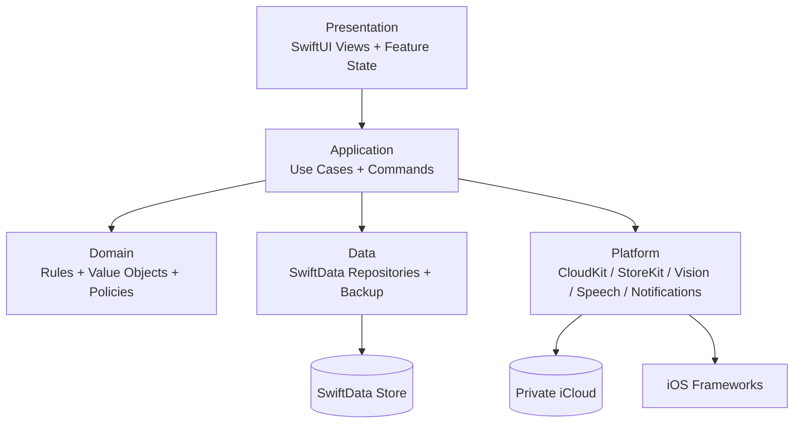
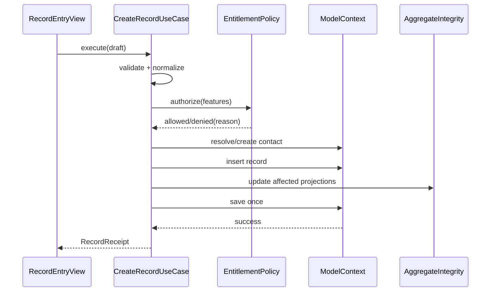

# 礼小记升级技术方案 v2.0

> 文档状态：实施基线  
> 编写日期：2026-07-11  
> 适用分支：`upgrade/product-audit-20260711`  
> 当前线上版本：1.0，生产代码基线为 `main@f582257`  
> 目标版本：1.2（核心升级一次开发、一次发布）  
> 发布决策：仅团队 TestFlight 验证，审核通过后立即 100% 全量发布  
> 关联文档：[升级审计与增长路线图](./2026-07-11-app-upgrade-audit.md)、[UI/UX 升级设计文档](./礼小记UI_UX升级设计文档-v2.0.md)

## 1. 文档目标

本方案用于指导礼小记从“功能齐全但写入链路分散的 SwiftUI App”升级为“数据可恢复、行为可验证、持续可演进的本地优先应用”。方案同时覆盖产品升级所需的新能力和现有代码的架构治理。

### 1.1 核心目标

1. 所有用户数据都能导出、校验、恢复和迁移，升级失败不能导致静默丢失。
2. 所有业务写操作经过统一用例层，并在单个事务内完成数据与聚合更新。
3. iCloud 页面只展示可证明的状态，不再把“账户可用”描述成“数据已同步”。
4. 支持回礼待办、历史依据、一键回礼、批量导入和联系人合并等核心升级功能。
5. 建立可执行的自动化测试、迁移测试、StoreKit 测试和发布门禁。
6. 保持本地优先、无广告、最小数据采集的产品承诺。

### 1.2 非目标

- 本阶段不建设开发者自有业务服务器。
- 不引入泛化 AI 聊天、LBS 礼俗库或 Dynamic Island。
- 不在 1.2 阶段同时开发 Android。
- 不为了“Clean Architecture”形式完整而为每个简单类型制造映射层。

## 2. 当前技术基线

### 2.1 技术栈

| 领域 | 当前实现 |
|---|---|
| UI | SwiftUI |
| 状态管理 | Observation、`@Observable`、`@State`、`@Query` |
| 数据持久化 | SwiftData |
| 云同步 | SwiftData + CloudKit automatic database |
| OCR | Vision；iOS 26 可选 Foundation Models 解析 |
| 语音 | Speech + AVFoundation；iOS 26 可选 Foundation Models 解析 |
| 图表 | Swift Charts |
| 购买 | StoreKit 2，非消耗型一次性购买 |
| 安全 | LocalAuthentication、后台遮罩 |
| 最低系统 | App target iOS 17.6 |

### 2.2 当前模块

```text
LiShangJi/
├── App
├── Models
├── Repositories
├── Services
├── Features
│   ├── Home
│   ├── GiftBook
│   ├── Record
│   ├── Contacts
│   ├── Events
│   ├── Statistics
│   ├── Premium
│   └── Settings
├── Navigation
└── Shared
```

目录具备按功能组织的基础，但业务规则的真实归属并不清晰：View、ViewModel、Repository 和 Service 都在直接修改模型并保存上下文。

## 3. 问题清单与治理决策

### 3.1 写入边界不统一

**现状：**

- `RecordViewModel` 直接创建联系人和记录。
- `RecordDetailView` 直接修改模型并 `try? modelContext.save()`。
- `RecordListView` 直接删除记录并手工修改缓存。
- OCR、语音页面循环调用会立即保存的 Repository。
- Repository 既做查询，又承载部分缓存规则，但无法阻止 View 绕过。

**后果：** 同一业务有多种实现；错误处理不一致；部分路径漏改缓存；无法保证原子性。

**决策：**

- Query 可以保留 SwiftData `@Query`，避免无价值封装。
- Command 必须进入 Application Use Case，不允许 View 直接 `save()` 或 `delete()`。
- Repository 只负责数据访问；跨实体规则由 Use Case/Domain Service 负责。
- 每个用户操作最多提交一次 `ModelContext.save()`。

### 3.2 批量操作不是原子事务

OCR 和语音批量保存逐条调用 `GiftRecordRepository.create()`，而该方法每条都会保存。中途失败后代码继续，最后仍然成功提示并关闭页面。

**决策：** 新增 `BatchCreateRecordsUseCase`：

1. 先验证所有输入并生成预览。
2. 计算联系人匹配、新增联系人和权益限制。
3. 在一个上下文中插入全部对象。
4. 一次性重建受影响聚合。
5. 单次保存；任一错误则整体回滚并保留校对页。

### 3.3 聚合缓存可能漂移

`Contact` 和 `GiftBook` 持久化保存 received/sent/count 三个聚合字段，并依赖各页面手工增减。删除账本会级联删除记录，但当前 `GiftBookRepository.delete()` 不会修正相关联系人缓存。

**决策：分两阶段治理。**

- v1.1 保留字段，集中由 `RecordMutationService` 更新，并提供 `AggregateIntegrityService` 重建和校验。
- v2.0 评估数据规模后选择按需查询或独立 Projection 模型；在没有性能证据前不继续增加缓存字段。

### 3.4 数据字段使用展示文本作为业务键

`eventCategory` 直接保存“婚礼”等中文名，类别改名、隐藏或未来本地化会造成关联不稳定。部分枚举和模型又保存英文 raw value，规则不一致。

**决策：**

- 业务关联使用稳定 UUID 或稳定 code。
- 记录保存 `categoryID` 与 `categoryNameSnapshot`，历史显示不受分类删除影响。
- 枚举 raw value 使用固定英文 code，中文只存在 UI 文案层。
- 迁移期保留旧字段，只读兼容，不直接删除 CloudKit 字段。

### 3.5 没有版本化 Schema 和 MigrationPlan

当前 Schema 直接由模型数组构造，模型已经变化但测试未同步。启动失败时直接 `fatalError`。

**决策：** 从现有线上结构冻结 `SchemaV1`，后续全部通过 `VersionedSchema` 与 `SchemaMigrationPlan` 演进。启动失败进入数据恢复界面，禁止直接崩溃退出。

### 3.6 单例和依赖硬编码

ViewModel 内部直接实例化 Repository，Service 大量使用 `.shared`，导致隔离测试困难。

**决策：** 使用轻量 `AppEnvironment` 注入协议实现。系统级资源可保持单实例，但通过协议暴露；不引入第三方 DI 框架。

## 4. 目标架构

### 4.1 分层



### 4.2 各层职责

| 层 | 可以做 | 不可以做 |
|---|---|---|
| Presentation | 展示、输入状态、导航、调用 Use Case | 直接保存/删除 SwiftData；判断付费规则 |
| Application | 编排事务、权限、备份、跨实体操作 | 绘制 UI；拼装系统弹窗 |
| Domain | 金额、方向、回礼状态、权益政策、校验规则 | 依赖 SwiftUI、ModelContext、CloudKit |
| Data | Fetch/insert/delete、备份序列化、迁移 | 决定产品付费边界和页面行为 |
| Platform | 系统权限、通知、购买、OCR、语音、同步健康 | 直接操纵页面状态 |

### 4.3 依赖容器

```swift
@MainActor
struct AppEnvironment {
    let recordCommands: RecordCommanding
    let backupService: BackupServicing
    let importService: ImportServicing
    let syncHealthService: SyncHealthServicing
    let entitlementService: EntitlementServicing
    let notificationService: NotificationServicing
    let diagnostics: DiagnosticsReporting
}
```

生产环境和测试环境分别构造。Feature 只接收真正需要的依赖，避免把容器作为全局 Service Locator 到处读取。

### 4.4 目标目录

```text
LiShangJi/
├── App/
│   ├── LiShangJiApp.swift
│   ├── AppEnvironment.swift
│   ├── AppContainerFactory.swift
│   └── AppRecoveryView.swift
├── Domain/
│   ├── Models/
│   ├── ValueObjects/
│   │   ├── Money.swift
│   │   ├── CategoryCode.swift
│   │   └── ReciprocityStatus.swift
│   ├── Policies/
│   │   ├── EntitlementPolicy.swift
│   │   └── ReturnGiftSuggestionPolicy.swift
│   └── Errors/DomainError.swift
├── Application/
│   ├── Records/
│   ├── Contacts/
│   ├── Books/
│   ├── Reminders/
│   ├── ImportExport/
│   └── Sync/
├── Data/
│   ├── Schema/
│   ├── Repositories/
│   ├── Migration/
│   ├── Backup/
│   └── Integrity/
├── Platform/
│   ├── CloudKit/
│   ├── StoreKit/
│   ├── Notifications/
│   ├── OCR/
│   ├── Speech/
│   ├── Security/
│   └── Diagnostics/
├── Features/
├── Navigation/
└── DesignSystem/
```

迁移采用渐进方式，不要求一次移动全部文件。每次功能修改时把对应写链路迁入新层。

## 5. 核心领域模型升级

### 5.1 Money

当前 `Double` 可能出现小数精度问题。领域层引入以分为单位的 `Money`，但考虑 1.0 与新版本可能通过 iCloud 同时修改同一记录，1.x 期间继续以线上字段 `amount: Double` 作为持久化真相：

```swift
struct Money: Hashable, Codable, Sendable {
    let minorUnits: Int64
    let currencyCode: String
}
```

领域转换规则：`minorUnits = Int64((amount * 100).rounded())`，保存时仍回写 `amount`。如果 Schema V2 增加可选 `amountMinor`，它在 1.x 只能作为可重建影子字段，读取和冲突处理始终以 `amount` 为准，防止 1.0 客户端只更新 `amount` 后产生双写不一致。只有完成旧客户端兼容窗口、混合版本验证通过并发布至少两个稳定版本后，才允许评估切换持久化真相；线上旧字段仍不得直接删除。

### 5.2 GiftRecord v2

| 字段 | 类型 | 说明 |
|---|---|---|
| `id` | UUID | 稳定主键 |
| `amount` | Double | 1.x 持久化金额真相，兼容线上 1.0 |
| `amountMinor` | Int64? | 可选影子字段，不作为 1.x 冲突真相 |
| `currencyCode` | String | 默认 CNY |
| `directionCode` | String | `received` / `sent` |
| `recordKindCode` | String | `cashGift` / `physicalGift` / `loan` |
| `contact` | Contact? | 当前联系人关联 |
| `contactNameSnapshot` | String | 防止解除关联后丢失历史名称 |
| `book` | GiftBook? | 所属账本 |
| `categoryID` | UUID? | 稳定分类关联 |
| `categoryNameSnapshot` | String | 历史展示快照 |
| `occasionTitle` | String | 事件标题 |
| `eventDate` | Date | 实际发生日期 |
| `familySideCode` | String | `mine` / `partner` / `shared` / `unspecified` |
| `reciprocityStatusCode` | String | `none` / `toReturn` / `returned` / `dismissed` |
| `linkedRecordID` | UUID? | 回礼与原始记录的可解释关联 |
| `sourceCode` | String | manual/ocr/voice/import |
| `note` | String | 用户备注 |
| `createdAt/updatedAt` | Date | 审计时间 |

“谁欠谁”不作为领域状态。系统只保存客观往来和用户选择的“待回礼”。

### 5.3 Contact v2

新增：

- `normalizedName`：用于去空格、全半角和大小写后的匹配。
- `aliases`：拆为 `ContactAlias` 模型，支持昵称、称谓和旧姓名。
- `familySideCode`：本人、伴侣、共同、未指定。
- `mergedIntoContactID`：迁移/合并审计，不直接静默删除来源。
- `lastInteractionAt`：由统一写链路维护或定期重建。

电话号码不是联系人唯一键。姓名匹配只用于建议，批量导入的模糊匹配必须让用户确认。

### 5.4 Category v2

- `id` 作为关联键。
- `code` 仅内置分类使用且不可变，如 `wedding`。
- `displayName` 可编辑。
- 删除自定义分类时，历史记录保留 snapshot。

### 5.5 Reminder v2

新增 `linkedContactID`、`linkedRecordID`、`completionActionCode`。提醒完成时可以直接进入预填回礼，而不是只切换布尔值。

### 5.6 BackupManifest

```json
{
  "format": "com.lixiaoji.backup",
  "formatVersion": 2,
  "createdAt": "2026-07-11T10:00:00Z",
  "appVersion": "1.1.0",
  "schemaVersion": 2,
  "recordCounts": {
    "books": 3,
    "contacts": 120,
    "records": 860,
    "reminders": 8
  },
  "payloadSHA256": "..."
}
```

## 6. Schema 与迁移方案

### 6.1 线上 V1 生产基线

线上 1.0 的唯一 Schema 基线固定为 `main@f582257`，不是升级分支开始修改后的模型。`SchemaV1` 必须逐字段复刻该提交中的以下 SwiftData 模型、默认值、可选性、关系和 delete rule：

- `GiftBook`
- `GiftRecord`
- `Contact`
- `GiftEvent`
- `EventReminder`
- `CategoryItem`

实施迁移前必须完成：

1. 从 `f582257` 构建 V1 测试 App，生成包含空数据、正常数据、重复分类、无联系人记录、OCR 附件和多账本关系的 fixture。
2. 保存 V1 SQLite store、sidecar 文件、JSON 期望结果和构建版本号，纳入测试资源。
3. 后续主干模型发生变化时，不得反向修改 `SchemaV1` 定义。
4. 发布记录必须保存 App Store build number 到 git commit 的映射。

### 6.2 版本策略

```swift
enum LiShangJiSchemaV1: VersionedSchema { ... }
enum LiShangJiSchemaV2: VersionedSchema { ... }

enum LiShangJiMigrationPlan: SchemaMigrationPlan {
    static var schemas: [any VersionedSchema.Type] { [V1.self, V2.self] }
    static var stages: [MigrationStage] { [migrateV1toV2] }
}
```

### 6.3 V1 到 V2

1. 启动前复制本地 store 和 sidecar 文件到 Recovery 目录。
2. 轻量迁移先增加可选字段，不删除 CloudKit 已存在字段。
3. 后处理填充 category snapshot、normalizedName 和稳定 code；可重建 `amountMinor` 影子值，但 1.x 仍以 `amount` 为准。
4. 运行完整性检查。
5. 成功后记录 migration receipt；失败则保持备份并进入恢复界面。

### 6.4 完整性检查

| 检查 | 失败处理 |
|---|---|
| 每个实体 UUID 非空且不重复 | 阻断完成，生成诊断 |
| 金额大于 0 且 Double/Minor 一致 | 自动修正可修复项 |
| 记录的 book/contact 引用有效或为 nil | 保留 snapshot，解除悬空引用 |
| 聚合结果与明细一致 | 自动重建聚合 |
| 内置 category code 唯一 | 合并重复内置分类 |
| 备份 checksum 正确 | 禁止导入 |

### 6.5 启动恢复状态

```text
normal
migrating(progress)
recoveryRequired(error, snapshots)
readOnlyInspection
```

恢复页面提供“重试升级”“从最近快照恢复”“只读导出诊断”，不能仅显示崩溃信息。

### 6.6 1.0 与新版本混合使用

同一 Apple ID 下可能出现 iPhone 已升级、iPad 仍停留在 1.0 的情况，不能假设所有设备同时升级。

兼容规则：

- 1.1 只增加可选字段或带默认值的新实体，不重命名、不删除线上 CloudKit 字段。
- 1.1 修改记录时继续写入 1.0 已知字段；新增字段不能成为基础记录可读性的唯一来源。
- 1.0 修改旧字段后，1.1 必须能重新派生 snapshot、normalizedName 和影子聚合。
- 1.1 新增的回礼、别名等能力在 1.0 中不可见，但不能导致基础记录消失或无法编辑。
- 混合版本期间不启用破坏性字段清理和不可逆关系重构。

必须增加以下双设备测试：

| 操作 | 1.0 设备 | 新版本设备 | 验收 |
|---|---|---|---|
| 修改金额 | 写 `amount` | 重新派生 Money/影子字段 | 两端金额一致 |
| 修改联系人名称 | 写旧 `name` | 更新 normalizedName/snapshot 策略 | 搜索与历史显示正确 |
| 删除记录 | 传播旧删除 | 重建聚合和待办 | 无残留待办 |
| 新增回礼关联 | 忽略未知字段 | 保留关联 | 1.0 仍可查看基础记录 |
| 新增别名 | 不展示别名 | 保留别名实体 | 1.0 不产生重复基础联系人 |

### 6.7 CloudKit Production Schema 顺序

1. 使用与线上相同 container 在 Development 环境验证 V1 -> V2。
2. 确认只包含新增 Record Type/字段/关系，不包含重命名或删除。
3. 先部署 CloudKit Production Schema，再提交依赖该 Schema 的 App 构建。
4. TestFlight 使用 Production 环境完成混合版本、离线和冲突测试。
5. Production Schema 一旦部署，后续仅允许前向兼容修正。

## 7. 统一写入用例

### 7.1 创建单条记录



返回 `RecordReceipt`，包含 recordID、是否新建联系人、回礼关联和展示消息。UI 不依赖刚写入的模型对象来判断成功。

### 7.2 批量创建

输入为已校对的 `[RecordDraft]`。预检结果必须包含：有效条数、错误条数、重复项、将新建联系人、权益影响和目标账本。存在错误时默认不提交。

### 7.3 编辑记录

编辑命令包含原始 `updatedAt`，保存前检测是否被 CloudKit/其他窗口修改。发生冲突时展示字段差异，默认保留较新值并允许用户选择。

### 7.4 删除记录

删除前采集受影响 contact/book ID；删除、聚合重建和通知取消在一个用例中完成。删除成功后提供短时 Undo；真正持久删除可在 Undo 窗口结束后执行，或使用 tombstone。

### 7.5 删除账本

不能只依赖 cascade：

1. Fetch 账本内记录和所有受影响联系人。
2. 生成删除摘要。
3. 删除记录和账本。
4. 重建相关联系人聚合。
5. 单次保存。

### 7.6 合并联系人

合并事务：迁移 records、reminders、aliases；保留目标联系人的用户字段；写入 merge receipt；重建聚合；删除或 tombstone 来源联系人。支持合并前预览和完成后 Undo。

## 8. 回礼助手逻辑

### 8.1 状态定义

- `none`：普通记录，不参与待办。
- `toReturn`：用户确认需要回礼。
- `returned`：已与一条送出记录关联。
- `dismissed`：用户明确无需回礼。

### 8.2 建议金额

第一阶段只提供可解释规则，不使用不可解释模型：

1. 找到 linked source record 或同一联系人的最近一条收到记录。
2. 默认建议原金额。
3. 展示常用金额快捷项，如原金额、向上取整到 100、用户最近三次相似场景金额。
4. 始终显示依据文字：“依据 2025-10-03 对方婚礼礼金 ¥800”。
5. 用户确认前不自动写入。

不根据职业、收入或关系价值自动推断金额。

## 9. 备份、导入与导出

### 9.1 备份格式

使用 `.lsxbackup` 文档包：

```text
backup.lsxbackup/
├── manifest.json
├── data.json
└── attachments/
```

使用 SHA-256 校验 payload；可选使用用户密码通过 CryptoKit AES-GCM 加密。密码不上传、不找回，页面必须明确说明。

### 9.2 自动快照

在以下操作前生成滚动快照：Schema 迁移、开启/关闭 iCloud、全量导入、联系人批量合并、清空数据。默认保留最近 5 份，并受磁盘空间上限约束。

### 9.3 CSV 导入管线


支持 UTF-8、UTF-8 BOM 和常见 Excel 导出；所有用户文本进行长度限制和 Unicode 规范化。导出 CSV 时对以 `= + - @` 开头的单元格做公式注入防护。

### 9.4 导入幂等

备份使用 UUID 去重；CSV 没有 UUID 时计算候选指纹，但只用于提示：`normalizedName + Money.minorUnits + direction + eventDate + book`。`Money.minorUnits` 由线上 `amount` 临时换算，不依赖影子字段。用户可以选择跳过、全部导入或逐条确认。

## 10. iCloud 同步方案

### 10.1 原则

- 本地数据始终是可用副本，离线可完整使用。
- 开启同步前先备份。
- 账户可用不等于同步完成。
- SwiftData 无法提供精确进度时，UI 必须使用诚实文案。

### 10.2 状态机

```text
disabled
checkingAccount
ready(accountAvailable, lastRemoteChange?)
activityDetected(date)
needsAttention(reason, recoveryAction)
restricted
noAccount
```

禁止使用无法证明的“所有数据已同步”。推荐显示“iCloud 已开启”“最近检测到云端变更：时间”“本地共有 N 条记录”。

### 10.3 开启流程

1. 校验 iCloud 账户。
2. 创建本地快照。
3. 检查 CloudKit 目标数据是否为空。
4. 若本地和云端均有数据，先进入合并预检。
5. 保存待切换配置，用户下次启动 App 时重建使用 CloudKit 配置的 `ModelContainer`。
6. 导入/合并并执行数量校验。
7. 成功后切换 UI；失败则恢复本地配置。

1.2 不在存量 `ModelContext` 仍被页面持有时热切换容器，避免同一 SQLite store 被两个容器并发打开。页面明确提示“下次启动生效”，不伪装成已经完成同步，也不尝试由 App 自行退出。后续若引入 App root 的 `AppContainerCoordinator`，必须先完成真机双端、前后台切换和失败回滚验证，才可改为进程内重建。

### 10.4 测试矩阵

| 场景 | 预期 |
|---|---|
| A 新增，B 在线 | B 最终出现且聚合一致 |
| A/B 离线编辑同一记录 | 冲突可检测，无重复/丢失 |
| A 删除账本，B 编辑其中记录 | 有确定的冲突策略和诊断 |
| 退出 iCloud 账户 | 本地只读/继续本地策略明确 |
| 关闭再开启同步 | 快照可恢复，数量不减少 |
| CloudKit schema 不可用 | 保留本地数据并提示修复 |

## 11. 权益与付费架构

### 11.1 权益模型

```swift
enum PremiumFeature {
    case multipleBooks
    case batchOCR
    case batchVoice
    case advancedStatistics
    case sharedBooks
    case smartReturnWorkflow
}
```

`EntitlementPolicy` 是唯一判断入口。View 只接收 `.allowed` 或 `.requiresPremium(feature, context)`。

### 11.2 免费能力

基础记录、联系人、提醒、iCloud、`.lsxbackup` 备份恢复、CSV 导入导出、基础隐私和数据删除必须免费。高级版仅包含多账本、OCR/语音批量录入、高级分析和回礼助手，不锁住用户自己的数据。

### 11.3 StoreKit

- 权益以 `Transaction.currentEntitlements` 为真相，UserDefaults 只作为短暂 UI 缓存。
- 处理 revoked、upgraded、family sharing 和未验证交易。
- 购买/恢复购买使用 StoreKit Configuration 自动测试。
- 产品 ID、展示名和线上价格只从 StoreKit 读取，不写死。

## 12. 权限、隐私与安全

### 12.1 权限时机

| 权限 | 请求时机 |
|---|---|
| 通知 | 用户第一次保存带提醒的事件时 |
| 相机 | 点击拍摄礼单后 |
| 相册 | 点击从相册选择后 |
| 麦克风/语音 | 点击开始语音录入后 |
| Face ID | 用户主动开启应用锁时 |

### 12.2 后台隐私

进入 inactive/background 时始终覆盖隐私遮罩，与应用锁开关无关；应用锁决定回到前台后是否需要认证。认证策略使用 `.deviceOwnerAuthentication`，允许系统密码回退，避免生物识别锁死用户。

### 12.3 语音隐私

二选一并在发布前确定：

- 隐私优先：仅在支持 `supportsOnDeviceRecognition` 时启用语音；否则解释不可用。
- 可用性优先：允许 Apple 服务端语音识别，并在权限前和隐私政策中准确披露。

不得继续使用“始终仅在本地处理”的绝对描述。

### 12.4 日志脱敏

统一使用 `Logger`，禁止输出姓名、电话、备注、OCR 原文、语音文本和完整金额。诊断包仅包含版本、Schema、实体数量、错误 code、同步状态和匿名操作时间线。

### 12.5 OCR 附件

OCR 成功提交时保存压缩原图到 `ocrImageData` 外部存储；完整备份只在字段非空时包含附件。CSV 始终不包含图片，避免无意义扩大表格文件。

## 13. 错误处理与可观测性

### 13.1 统一错误

```swift
enum AppError: LocalizedError {
    case validation(ValidationIssue)
    case persistence(PersistenceIssue)
    case migration(MigrationIssue)
    case importFailure(ImportIssue)
    case sync(SyncIssue)
    case entitlement(PremiumFeature)
    case permission(PermissionKind)
}
```

每个错误包含用户文案、恢复动作、内部 code。禁止 `try?` 吞掉用户操作错误。

### 13.2 UI 状态

所有异步 Feature 使用：

```text
idle -> validating -> working(progress?) -> success(receipt)
                                  \-> failure(error, recovery)
```

按钮工作中禁用重复提交；成功只在持久化完成后触发反馈。

### 13.3 隐私友好的指标

第一阶段使用 App Store Connect、Organizer、TestFlight 和本地诊断。若增加匿名产品指标，必须可关闭、无用户 ID、不包含业务内容，并先更新隐私政策。

建议事件只记录结果：首次记录完成、导入开始/成功/失败 code、备份验证成功、付费页来源、购买结果、提醒完成。不记录姓名、金额和备注。

## 14. 性能方案

### 14.1 数据访问

- 列表全部分页或 fetchLimit，不在 View 中加载全表后过滤。
- `EventReminderRepository.fetchByContact` 改为 Predicate 查询，禁止 fetchAll 后内存过滤。
- 搜索输入 250ms debounce，并限制首屏结果。
- 统计按时间范围 Fetch，不默认遍历所有附件和关系。

### 14.2 并发

- UI 写入 Use Case 标注 `@MainActor` 或明确使用独立 `ModelContext`。
- OCR、CSV 解析、备份校验在非主线程执行；最终插入切回持久化 actor。
- 不跨 actor 传递 SwiftData Model 实例，传 UUID 或 Sendable DTO。

### 14.3 性能预算

| 操作 | 目标 |
|---|---:|
| 冷启动，1000 条记录 | < 1.5s 到可交互 |
| 首页查询 | < 300ms |
| 联系人搜索 | < 150ms |
| 单条保存 | < 200ms |
| 1000 行 CSV 预检 | < 2s |
| 1000 条备份恢复 | < 5s，不阻塞 UI |

## 15. 测试策略

### 15.1 测试金字塔

| 层级 | 覆盖 |
|---|---|
| Domain 单元测试 | Money、校验、回礼状态、权益、建议金额 |
| Use Case 集成测试 | 单/批量写入、删除、合并、聚合、回滚 |
| Repository 测试 | Predicate、排序、分页、in-memory container |
| Migration 测试 | 真实 V1 fixture 到 V2、失败恢复、幂等 |
| Backup round-trip | export -> clear -> restore -> deep equality |
| StoreKit 测试 | 购买、恢复、撤销、Family Sharing |
| UI 测试 | onboarding、录入、导入、回礼、付费、恢复 |
| Accessibility | VoiceOver label、大字体、Reduce Motion、对比度 |

### 15.2 必须补充的回归用例

1. 删除账本后联系人聚合正确。
2. 编辑金额、方向、联系人、账本后的所有聚合正确。
3. 批量第 N 条失败时一条都不保存。
4. OCR/语音创建联系人遵守统一权益规则。
5. 导入重复数据可预览且不静默覆盖。
6. 备份损坏或版本过新时不修改现有数据库。
7. 开关 iCloud 失败可以回到原本地数据。
8. ModelContainer 创建失败进入恢复页而非崩溃。
9. CSV 导出不会触发公式执行。
10. 应用锁关闭时，后台任务快照仍遮挡敏感金额。

### 15.3 CI 门禁

每个 PR 执行：

```text
format/check -> build Debug -> unit/integration tests
             -> build Release -> UI smoke -> artifact summary
```

每次候选发布额外执行迁移 fixture、StoreKit、备份 round-trip、iPad UI 和 CloudKit 手工矩阵。

测试 target deployment target 与 App 保持一致。CI 至少验证最低系统兼容构建和当前系统模拟器运行。

## 16. 设计系统与导航代码治理

### 16.1 DesignSystem

将 `Shared/Components` 和主题 Token 合并为 `DesignSystem`：Color、Typography、Spacing、Radius、Icon、Component、Modifier。组件只封装重复行为，不把整个页面做成巨型通用组件。

### 16.2 导航

定义 Feature route：

```swift
enum AppRoute: Hashable {
    case record(UUID)
    case contact(UUID)
    case book(UUID)
    case reminder(UUID)
    case importData
    case backup
    case premium(source: PremiumSource)
}
```

iPhone 使用 Tab + NavigationStack；iPad 使用 NavigationSplitView。两者共享 route 和 destination factory，避免每个页面重复 `.sheet` 状态。

### 16.3 Feature State

复杂页面使用单一 Feature Model 管理输入、异步状态和路由意图。简单只读页面可直接使用 `@Query`，不强制建立空 ViewModel。

## 17. 兼容与发布策略

### 17.1 不可变生产标识

以下标识已经被线上 1.0 和用户数据使用，升级不得修改：

| 类型 | 线上值/规则 |
|---|---|
| Git 生产基线 | `main@f582257` |
| Bundle ID | `com.xxl.LiShangJi` |
| iCloud Container | `iCloud.com.xxl.LiShangJi` |
| StoreKit Product ID | `com.xxl.LiShangJi.premium` |
| SwiftData store | 保持线上默认 store URL/配置；变更必须走显式迁移 |
| CloudKit 字段 | 已部署名称不得重命名或删除 |
| 通知标识 | 兼容 `birthday_`、`festival_`、`event_` 前缀，并清理旧通知后再重建 |

已购买非消耗型商品的用户必须自动获得升级后的高级能力，不要求再次购买。产品重新分层只能把能力免费化或增加已购权益，不能撤销线上购买承诺。

### 17.2 UserDefaults 兼容

必须保留或显式迁移以下线上 key：

| Key | 兼容要求 |
|---|---|
| `hasAgreedToTerms` | 已同意用户升级后不重复进入新用户流程 |
| `isAppLockEnabled` | 不得因升级静默关闭应用锁 |
| `iCloudSyncEnabled` | 保持用户原选择；迁移失败时回到原存储配置 |
| `colorSchemePreference` | 保留外观偏好 |
| `isPremiumUnlocked` | 仅作快速缓存，最终由 StoreKit 校验；不能因短暂离线闪退权益 |
| `didMigrateCachedAggregates_v1` | 保留旧 receipt；新迁移使用新的独立版本 key |
| `lunarSectionExpanded` | 可保留；删除前提供默认行为兼容 |

新首页和新导航不能复用旧 onboarding key 表示新的教学已完成；需要独立、可跳过的 `didSeeHomeUpgrade_v2`。

### 17.3 1.2 单次交付

| 版本 | 技术交付 |
|---|---|
| 1.2 | 测试与 CI、VersionedSchema、备份恢复、CSV 导入、统一写入、回礼助手、新导航、iPad Split View、隐私与无障碍 |
| 后续评估 | 家庭共享账本、Widget/App Intent、实物礼品记录；不在本次范围 |

### 17.4 Feature Flag

1.2 的新导航、CSV 导入和数据管理默认启用。仅保留构建期前向修复开关，不建设远程配置或行为分析系统；线上异常通过基于 V2 的 1.2.1 补丁处理。

### 17.5 回滚

- Schema 变更只做向前兼容的增量字段。
- 任何批量操作前创建快照。
- 新代码能读取旧字段；旧版本不会被要求读取新必填字段。
- 发布后发现问题时关闭 feature flag，不通过删除新数据回滚。
- 一旦 V2 Schema 已向 Production 写入数据，不发布旧二进制作为回滚版本；紧急修复必须基于 V2 向前发布兼容补丁。
- 本次按产品决策立即 100% 发布；因此发布前必须完成 7 天团队 TestFlight 稳定运行、双设备混合版本验证和前向修复预案，任一门槛未通过不得提交审核。

### 17.6 备份与导出格式兼容

- 备份读取器至少支持当前版本和前两个 `formatVersion`。
- 新版本必须能读取所有历史备份；格式过新时只读检查，禁止覆盖当前数据。
- CSV 已发布列名视为外部契约；新增列追加到末尾，导入器支持旧列缺失和别名映射。
- 每个备份格式版本保留固定 fixture 和 round-trip 测试。

## 18. 实施顺序

### Phase A：工程基线，1-2 周

- 修复现有测试编译和 target 配置。
- 引入 AppEnvironment、统一错误和 Logger。
- 禁止新增 View 直接 `save/delete`。
- 后台遮罩与权限时机修复。

### Phase B：数据可信，3-5 周

- 冻结 V1 Schema，建立 V2 MigrationPlan。
- 备份/恢复与完整性检查。
- CSV 导入预检。
- 集中 Record/Book/Contact 写用例并修复聚合。

### Phase C：核心产品，6-8 周

- 回礼状态与 linked record。
- 新首页和一键回礼。
- 联系人合并、别名和家庭归属。
- 批量录入事务化。

### Phase D：体验与增长，9-12 周

- iPad 导航。
- 无障碍、性能、诊断。
- 评分触发和可选匿名指标。
- StoreKit 权益重新分层。

## 19. 验收标准

### 19.1 数据

- V1 数据迁移后实体数量、关系和金额 100% 通过校验。
- 备份 round-trip 后深度一致。
- 批量操作不产生部分提交。
- 删除/编辑/合并后的聚合无漂移。

### 19.2 稳定性

- 自动化测试全部通过。
- 无 `fatalError` 作为用户数据错误处理。
- 用户触发的保存不允许 `try?` 静默失败。
- Release 构建无高优先级 warning。

### 19.3 隐私

- 后台快照默认遮罩。
- 权限仅在功能上下文请求。
- 隐私文案与实际 Speech/CloudKit 行为一致。
- 诊断和指标不包含业务内容。

### 19.4 体验

- 首条手动记录中位完成时间小于 10 秒。
- 100 条批量导入能够预检、纠错和一次提交。
- 用户可在 10 秒内从联系人历史创建回礼记录。
- iPad 不再呈现横向拉伸的单列 iPhone 页面。

## 20. 风险与应对

| 风险 | 概率 | 影响 | 应对 |
|---|---|---|---|
| SwiftData/CloudKit 迁移导致历史数据异常 | 中 | 极高 | V1 fixture、迁移前快照、增量字段、7 天团队设备验证、前向补丁 |
| 1.0 与新版本同时修改 iCloud 数据 | 高 | 高 | 旧字段继续作为 1.x 真相、混合版本双设备测试、延迟字段清理 |
| Bundle/Container/Product ID 被误改 | 低 | 极高 | 不可变标识清单、Release 配置自动校验 |
| UserDefaults key 变更导致锁、同步或 onboarding 状态丢失 | 中 | 高 | key 清单、显式迁移、升级 UI 测试 |
| 聚合治理期间新旧路径并存 | 高 | 高 | 禁止新增直接写入；按 Feature 逐个切换；完整性重建 |
| CSV 格式差异过多 | 高 | 中 | 列映射、样例模板、错误预览、适配器而非硬编码 |
| iCloud 无精确进度 API | 高 | 中 | 诚实状态模型，不承诺无法证明的完成状态 |
| 免费能力调整影响已购用户理解 | 中 | 中 | 已购权益只增不减；解释“数据能力免费、效率能力高级” |
| 家庭共享增加冲突复杂度 | 中 | 高 | 推迟到数据迁移和单用户同步稳定后实施 |
| Foundation Models 仅新系统可用 | 高 | 低 | AI 作为增强；旧系统使用确定性解析并明确能力差异 |

## 21. 开发检查清单

- [ ] PR 是否新增了 View 直接写 `ModelContext`？
- [ ] 写操作是否只有一次 save 且可回滚？
- [ ] 是否更新 Schema、迁移测试和备份格式？
- [ ] 是否处理旧字段和旧数据？
- [ ] 是否有用户可执行的错误恢复动作？
- [ ] 是否泄露姓名、金额、备注或原始识别文本到日志？
- [ ] 是否在最低系统下编译？
- [ ] 是否支持 Dynamic Type、VoiceOver 和 Reduce Motion？
- [ ] 权益判断是否来自统一 Policy？
- [ ] 文案是否准确描述同步和隐私行为？
